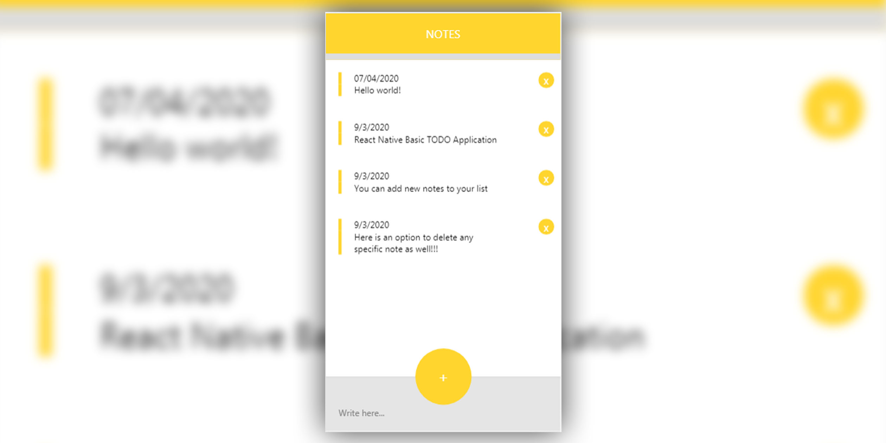

# react-native-basic-ToDoApp
This application has been developed for learning purpose. You can use this basic application for a quick start to understand custom styling, states and props, Views, ScrollViews, TextInputs etc.

# Usage
```bash
git clone https://github.com/Azzzhar7/react-native-basic-ToDoApp.git
```

Or download repository zip file.

```bash
npm install
```
```bash
npm start OR expo start
```
# Prerequisites
Node >= v.12

Expo CLI

# Output


